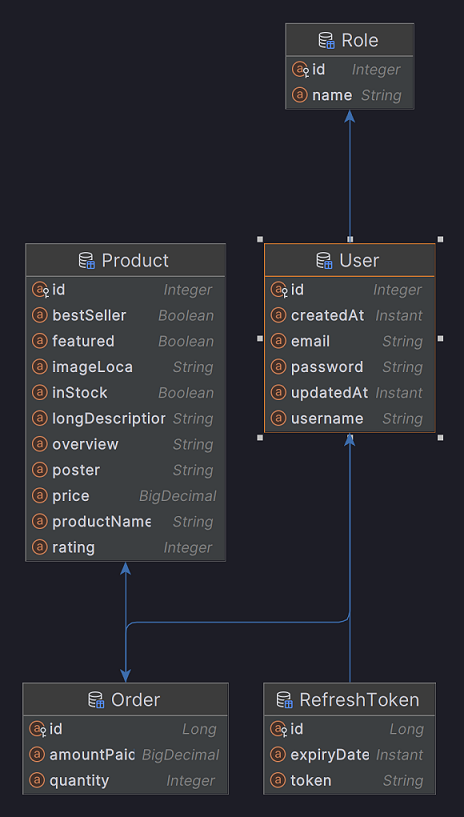

# Demo Ecommerce Full Stack
Combined project for front end with React and backend with Spring boot.

View [live project](https://ecom.demo.knartdev.top/)

## Run locally
Requirements: `java`, `node`, `npm` installed.

The local PostgreSQL database must be set up as followed:
```
DB_HOST: "localhost"
DB_USERNAME: "postgres"
DB_PASSWORD: "password"
DB_NAME: "demo_ecom"
DB_PORT: 5432
```
### Launch backend api
Navigate to `demo_ecom_api` directory and lauch Springboot api application with command:
```
./mvnw spring-boot:run
```
Springboot backend api should be running on `localhost:8080`

**Run test**
```
./mvnw test
```

### Launch frontend 
Navigate to `demoEccomerceReactApp` directory and run command
```
npm run dev
```
Web app should be running on `http://localhost:3000`

## Run the app with docker
Run the command:
```bash
docker compose up 
```

## Database architecture


